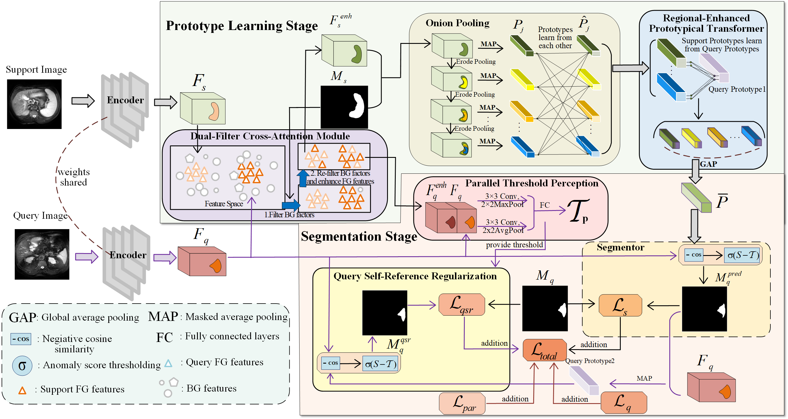

# DCOP-Net
Code for paper： DCOP-Net: A dual-filter cross attention and onion pooling network for
few-shot medical image segmentation



### Implementation Details
Few-shot learning has demonstrated remarkable performance in medical image segmentation. 
In our manuscript, we propose a dual-filter cross-attention and onion pooling network (DCOP-Net)
for FSMIS. Our model contains two stages: a prototype learning stage and a segmentation stage. 
During the prototype learning stage, we design a Dual-Filter Cross Attention (DFCA) module and  an Onion Pooling (OP) module.
In the segmentation stage, we present a Parallel Threshold Perception (PTP) module and a Query Self-Reference Regularization (QSR) strategy.
Specifically,

1)The DFCA module utilizes a priori masks and adaptive attention filtering methods to filter background factors in the feature graph from two aspects, effectively integrating query foreground features into support features.

2)The OP module generates multiple masks using erode pooling and combines  masked average pooling to extrate multiple prototypes, effectively preserve contextual information in the feature map.
                                                                                                                   
3)The PTP module combines maximum pooling and average pooling dual paths to process the features in parallel. Finally, it obtains a robust threshold that effectively distinguishes between foreground and background after full learning in the fully connected layer.

4)The QSR strategy utilizes the prediction results and the query image to generate a prototype, and then segments the query image to obtain a new loss. This forms a feedback mechanism for the model and improves the accuracy and consistency of the segmentation of the model.

# Environment
### Dependencies
Please install following essential dependencies:
```
dcm2nii
json5==0.8.5
jupyter==1.0.0
nibabel==2.5.1
numpy==1.22.0
opencv-python==4.5.5.62
Pillow>=8.1.1
sacred==0.8.2
scikit-image==0.18.3
SimpleITK==1.2.3
torch==1.10.2
torchvision=0.11.2
tqdm==4.62.3
```
### Requirements
```
IDE: PyCharm 2022.3 Community Edition.
Framework: PyTorch 2.0.1.
Language: Python 3.11.2
CUDA: 12.1
```
# Running the Experiments
### Datasets
Pre-processing is performed according to [Ouyang et al.](https://github.com/cheng-01037/Self-supervised-Fewshot-Medical-Image-Segmentation/tree/2f2a22b74890cb9ad5e56ac234ea02b9f1c7a535) and we follow the procedure on their github repository.

The pre-processed data and supervoxels can be downloaded by:
1) [Pre-processed CHAOS-T2 data and supervoxels](https://drive.google.com/drive/folders/1elxzn67Hhe0m1PvjjwLGls6QbkIQr1m1?usp=share_link)
2) [Pre-processed SABS data and supervoxels](https://drive.google.com/drive/folders/1pgm9sPE6ihqa2OuaiSz7X8QhXKkoybv5?usp=share_link)
3) [Pre-processed CMR data and supervoxels](https://drive.google.com/drive/folders/1aaU5KQiKOZelfVOpQxxfZNXKNkhrcvY2?usp=share_link)

### Train a model
1. Compile `./supervoxels/felzenszwalb_3d_cy.pyx` with cython (`python ./supervoxels/setup.py build_ext --inplace`) and run `./supervoxels/generate_supervoxels.py` 
2. Download pre-trained ResNet-101 weights [vanilla version](https://download.pytorch.org/models/resnet101-63fe2227.pth) or [deeplabv3 version](https://download.pytorch.org/models/deeplabv3_resnet101_coco-586e9e4e.pth) and put your checkpoints folder, then replace the absolute path in the code `./models/encoder.py`.  
3. Run `./script/train.sh` 

### Evaluate a model
Run `./script/test.sh` 

### Acknowledgement
Code is based the works: [RPTNet](https://github.com/YazhouZhu19/RPT) ,[SSL-ALPNet](https://github.com/cheng-01037/Self-supervised-Fewshot-Medical-Image-Segmentation), [ADNet](https://github.com/sha168/ADNet) and [QNet](https://github.com/ZJLAB-AMMI/Q-Net)


